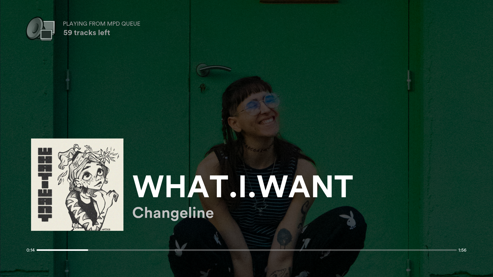
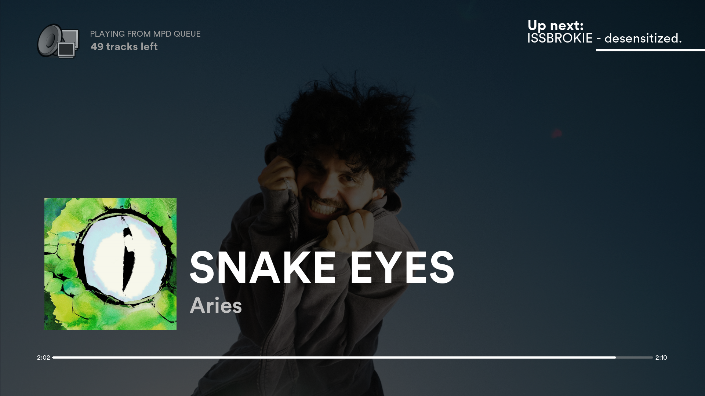
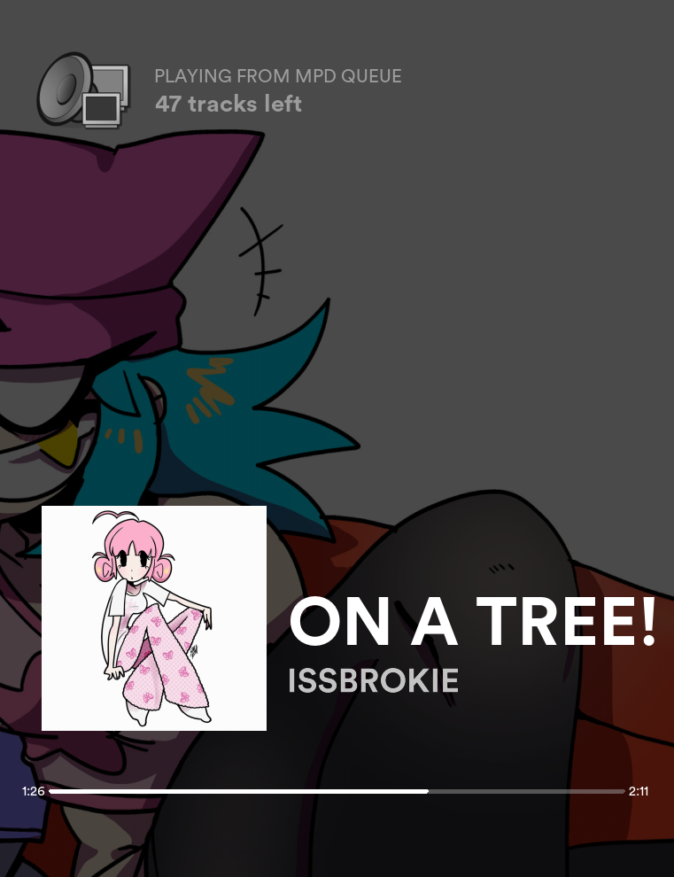
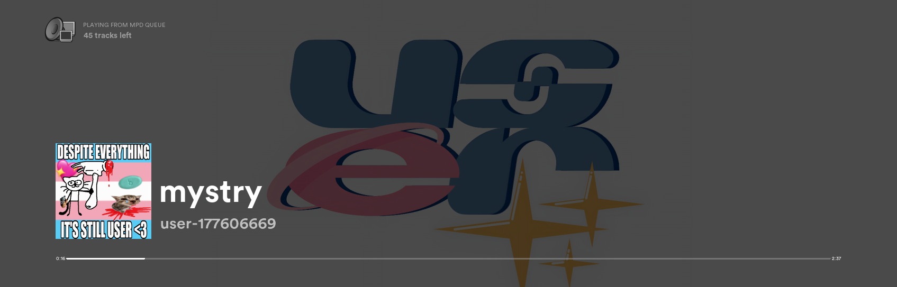
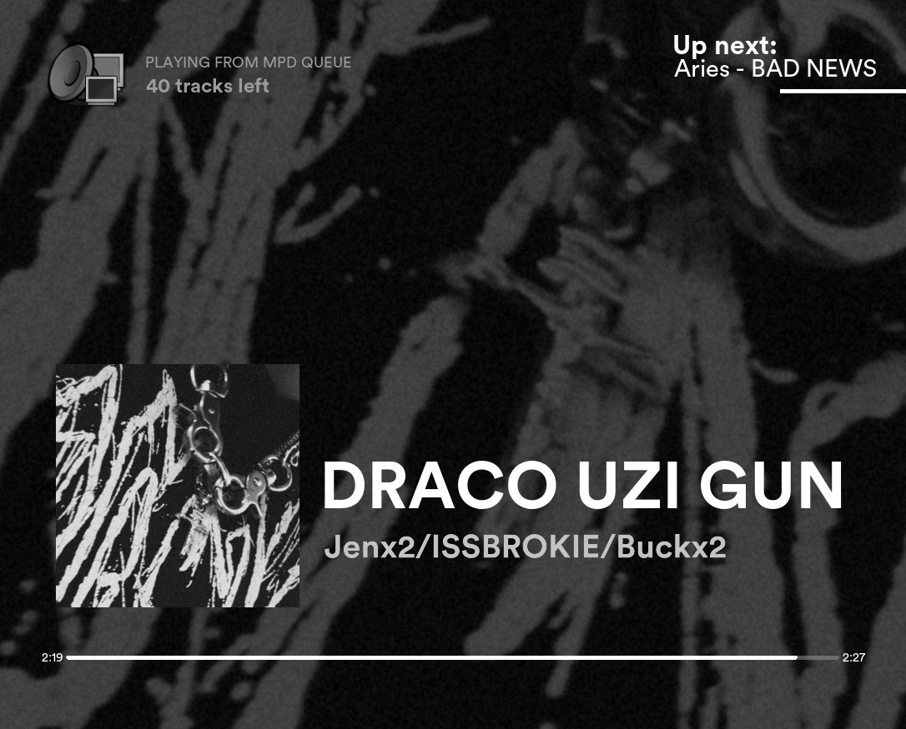
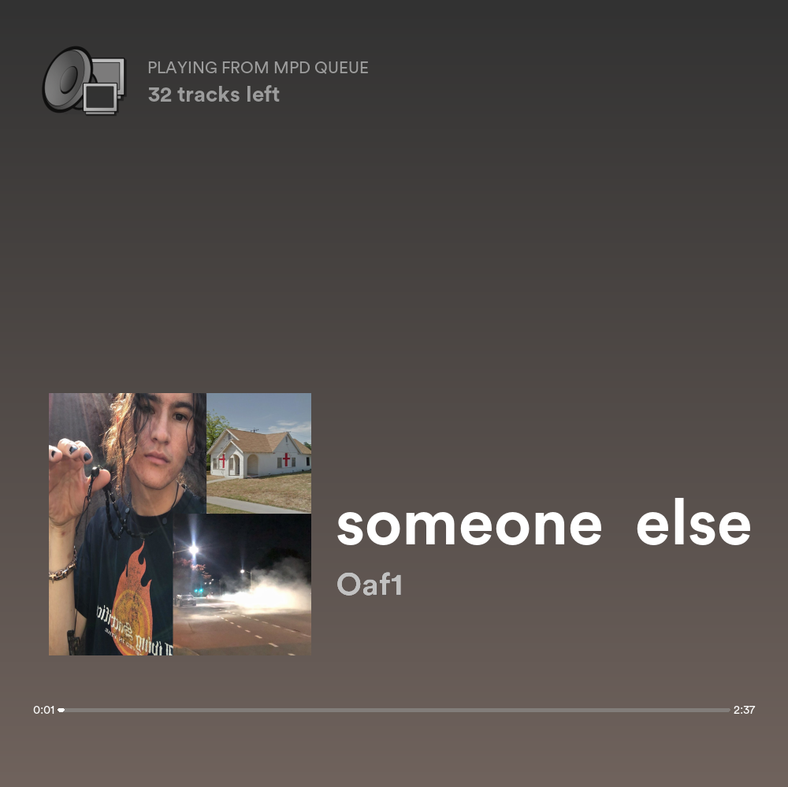
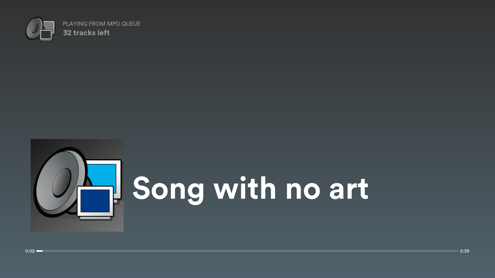
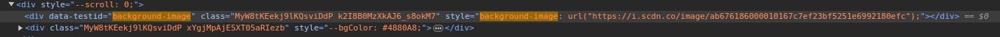
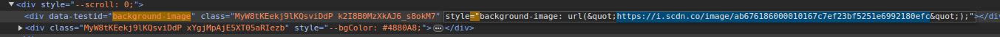

# Spotify-like graphical display for MPD

Note that this is not a full MPD client, as it only *displays* data.
Eventually I want to rewrite it in *anything* that isn't pygame.

This will probably only work on linux.
Requires MPC.

## Features
- Toggleable fullscreen with the `f` or `F11` key
- Fully resizable window, all screen elements will be properly scaled/positioned
- Artist-specific background art (See more [here](https://github.com/allylikesu/mpd-display#obtaining-and-using-artist-background-images))
- Design basically fully ripped off of the Spotify desktop client's fullscreen mode
- Extremely poorly optimized
- Click or press space to play/pause
- "Up Next" display when current song hits 90% completion
- Easy to quit with `Esc` or `q`

## Screenshots














## Installation/Usage
I provide no packaging solutions. Clone the repo and run main.py.

The `-f` flag will make the app launch in fullscreen.

A portable launch script can be made and put in $PATH using this template:
```
#!/usr/bin/env bash

cd <PATH TO CLONED REPO> || exit 1

python3 main.py [-f]
```

## Obtaining and using artist background images
For Spotify's fullscreen mode, it uses a slightly darkened version of the main artist's profile banner as a background.
If the artist does not have a profile banner, a gradient based on the song's album art is used.

This behaviour is replicated by this program, but the images need to be manually obtained.
If you don't care about Spotify and have your own images you want to use, that is totally cool!
The format of the file should be `<artist name>.jpg`.
The file name should be in **ALL LOWERCASE!**

Obtaining profile banners from Spotify is simple but a little annoying. 
1. navigate to the artist's profile on the Spotify web client. Using Firefox might not work, I had to do this in Chromium.
2. Press `Ctrl+Shift+I` to enter the developer console and inspect the element of the page.
3. Press `Ctrl+F` to open the search prompt. Search for `"background-image:`. The first result should look like this.

4. Copy the i.scdn.co link. This is the link to the image. Make sure to *NOT* copy the `&quot;` before and after the link.

5. Open this link in your browser. Right click and save it to the `artists/` folder as `<lowercase artist name>.jpg`

### Artist name parsing
In order to display the correct image, this program parses the first artist in the song's artist metadata. There are multiple formats used to separate artist names in this metadata, and improperly parsing this data can cause the program to search for the wrong image file. Current delimeters used are `,_`, `/`, and `_&_` (underscores representing spaces). If you encounter issues due to your files using a different format, please open an issue.


